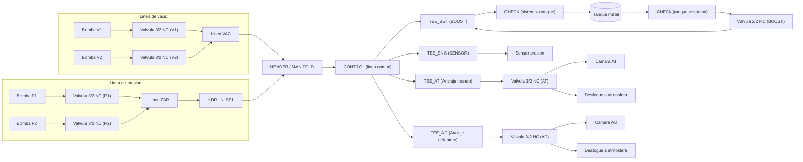

# Diagrama neumatico (version inicial basada en diagrama actual)

Notas:
- Valvulas **NC** por defecto. En reposo: **A -> R abierto**, **P cerrado**.
- Se usan 3/2 y cuando hace falta 2/2 se **tapa un puerto**.
- Check valves solo en el tanque (carga y descarga).
- Tanque metal: **0.3 L**, conectado en TEE de BOOST.
