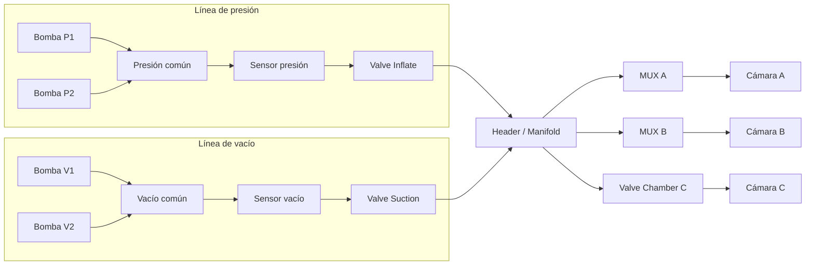

# Diagrama neumático vigente

```mermaid
flowchart LR
    subgraph Presion["Línea de presión"]
        P1["Bomba P1"] --> Pmerge["Presión común"]
        P2["Bomba P2"] --> Pmerge
        Pmerge --> SP["Sensor presión"]
        SP --> VP["Valve Inflate"]
    end

    subgraph Vacio["Línea de vacío"]
        V1["Bomba V1"] --> Vmerge["Vacío común"]
        V2["Bomba V2"] --> Vmerge
        Vmerge --> SV["Sensor vacío"]
        SV --> VV["Valve Suction"]
    end

    VP --> M["Header / Manifold"]
    VV --> M

    M --> MA["MUX A"]
    M --> MB["MUX B"]
    M --> MC["Valve Chamber C"]

    MA --> CA["Cámara A"]
    MB --> CB["Cámara B"]
    MC --> CC["Cámara C"]
```

## Notas
- La **precarga** ocurre upstream de `Valve Inflate` o `Valve Suction`.
- `MUX A`, `MUX B` y `Valve Chamber C` son las tres salidas lógicas de cámara.
- El pin legacy BOOST ya no representa tanque ni turbo; hoy es la compuerta de Cámara C.
- La referencia operativa del control está en `docs/protocolo_neumatico_atomico.md`.
